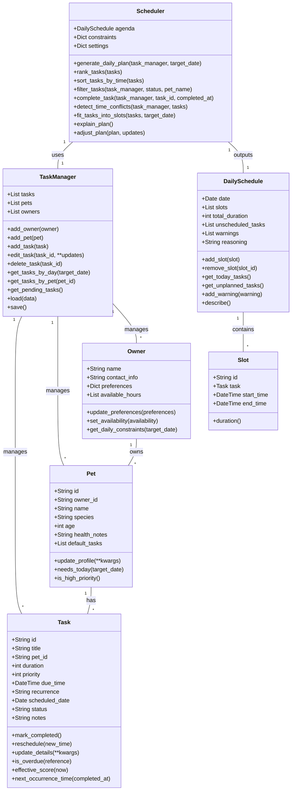

# PawPal+ Project Reflection

## 1. System Design

**Core Actions:**

- Enter owner + pet info
    - add owner name / preferences
    - add pet profile(s) (name, type, age, needs)
- Add task
    - create pet care tasks (walk, feeding, meds, grooming, enrichment, etc.)
    - include duration and priority (and optionally schedule constraints)
- Edit task
    - modify task details (duration, priority, type, pet association)
- Generate daily plan/schedule
    - run scheduler using constraints + priorities + available time
    - build list of today’s tasks in time order
- View today’s plan
    - display tasks for the day clearly
    - show schedule/time blocks
- Explain reasoning (optional but requested)
    - show why tasks were chosen/ordered (priority, constraints, time optimization)
- Testing/validate
    - automated checks for scheduling behavior (coverage for core logic)

**a. Initial design**

- Briefly describe your initial UML design.
- What classes did you include, and what responsibilities did you assign to each?

  - `Owner`
    - attributes: `name`, `contact_info`, `preferences`, `available_hours`
      - e.g., owner preferences for times and max daily task load
    - methods: `update_preferences()`, `set_availability()`, `get_daily_constraints()`
      - (adjust preference data, define when owner is available, return constraints for scheduling)

  - `Pet`
    - attributes: `name`, `species`, `age`, `health_notes`, `default_tasks`
      - (house pet profile and baseline care needs)
    - methods: `update_profile()`, `needs_today()`, `is_high_priority()`
      - (update details, determine today-specific task need, identify urgent care)

  - `Task`
    - attributes: `id`, `title`, `pet_id`, `duration`, `priority`, `due_time`, `recurrence`, `status`, `notes`
      - (defines each care item and metadata for schedule logic)
    - methods: `mark_completed()`, `reschedule(new_time)`, `update_details()`, `is_overdue()`, `effective_score()`
      - (task lifecycle and score used for ranking/constraint decisions)

  - `TaskManager`
    - attributes: `tasks`, `pets`, `owners`
      - (data store for all entities, could be in-memory or persisted)
    - methods: `add_task()`, `edit_task()`, `delete_task()`, `get_tasks_by_day(date)`, `get_tasks_by_pet(pet_id)`, `get_pending_tasks()`, `load/save()`
      - (CRUD plus helper query methods and persistence)

  - `Scheduler`
    - attributes: `agenda`, `constraints`, `settings`
      - (schedule candidate data plus constraint information and tuning rules)
    - methods: `generate_daily_plan(date)`, `rank_tasks()`, `fit_tasks_into_slots()`, `explain_plan()`, `adjust_plan()`
      - (core heuristics: build a plan, rank, pack into time slots, and explain or tweak results)

  - `DailySchedule`
    - attributes: `date`, `slots`, `total_duration`, `unscheduled_tasks`, `reasoning`
      - (concrete daily output plus any remaining tasks and scheduling narrative)
    - methods: `add_slot(task,start_time)`, `remove_slot(slot_id)`, `get_today_tasks()`, `get_unplanned_tasks()`, `describe()`
      - (manage produced schedule entries and derive display text)

**Mermaid class diagram**

**b. Design changes**

- Did your design change during implementation?
- If yes, describe at least one change and why you made it.

- Added owner_id to Pet
    - Reason: Enforces the Owner 1-* Pet relationship from the diagram; avoids orphan pets in logic and supports per-owner task filtering.
- Added scheduled_date to Task
    - Reason: TaskManager.get_tasks_by_day() now has a concrete way to filter tasks. Without this, “by-day” queries are ambiguous and would require separate “due_time” treatment.
- Added Slot dataclass and switched DailySchedule.slots to List[Slot]
    - Reason: Makes schedule slot structure explicit; improves type safety and aligns with the idea of timetable entries, rather than opaque dicts.
- Updated DailySchedule.add_slot() signature to take Slot
    - Reason: Avoids stale code path mismatch (task+start_time vs structured slot object), and future-proofs schedule manipulation.

---

## 2. Scheduling Logic and Tradeoffs

**a. Constraints and priorities**

- What constraints does your scheduler consider (for example: time, priority, preferences)?
- How did you decide which constraints mattered most?

**b. Tradeoffs**

- Describe one tradeoff your scheduler makes.
- Why is that tradeoff reasonable for this scenario?

Merge rank_tasks and sort_tasks_by_time into one ordering rule in pawpal_system.py:272

We currently have two separate sorting methods.
If the real scheduling behavior is “highest score first, earlier due time as tie-breaker,” then one sort is easier to reason about than two utilities.
Example rule:
sort by negative effective score
then by whether due_time is missing
then by due_time
That removes duplicated “how tasks are ordered” logic.

---

## 3. AI Collaboration

**a. How you used AI**

- How did you use AI tools during this project (for example: design brainstorming, debugging, refactoring)?
- What kinds of prompts or questions were most helpful?

I mostly used GitHub Copilot agent mode. I started out guiding it more specifically, but as it gained more of a foundational context in the project I found I was able to give it pretty much the raw project spec from the course portal and got good results.

**b. Judgment and verification**

- Describe one moment where you did not accept an AI suggestion as-is.
- How did you evaluate or verify what the AI suggested?

I noticed an edge case that stemmed from the test logic relying on a date calculation falling on the current date, which resulted in a non-deterministic test result depending on the time of day you're running the test. Out of curiosity, I just told the AI that the test failed (I was running it in the evening) and was glad to see the AI then caught the same issue.

---

## 4. Testing and Verification

**a. What you tested**

The suite covers five behavioral categories across 20 tests:

**Domain model correctness**
- Owner preferences are stored and returned correctly by `get_daily_constraints()`.
- Pet urgency detection (`is_high_priority()`) reflects changes to `health_notes`.
- Task lifecycle: `mark_completed()` changes status; `reschedule()` updates both `due_time` and `scheduled_date`; `is_overdue()` correctly ignores completed tasks.
- `effective_score()` produces a higher value for tasks due soon than for identical tasks due hours later.

These are important because all scheduling decisions depend on these properties being correct. A wrong score or a missed status change would silently corrupt the plan without obvious symptoms.

**Task manager CRUD and queries**
- Adding a duplicate task or owner raises `ValueError`.
- `get_tasks_by_day()` matches on both `scheduled_date` and `due_time.date()`.
- `edit_task()` mutates in place; `delete_task()` removes only the target.

These guard the fundamental data integrity that every other part of the system relies on.

**Sorting contracts**
- `sort_tasks_by_time()` places undated tasks last, and respects chronological order even when a later task has higher priority (due-time wins over priority in this view).
- `rank_tasks()` surfaces the highest effective score first, using due time only as a tie-breaker.

Two separate sorting methods serve two distinct use cases in the UI. Testing them independently prevents the methods from silently drifting into the same behavior.

**Scheduling constraints and packing**
- `generate_daily_plan()` with `max_minutes=120` schedules exactly the tasks that fit and puts the rest in `unscheduled_tasks`.
- A task whose duration exactly equals the remaining budget is scheduled (boundary test).
- When no tasks are due on the target date, the planner falls back to all pending tasks rather than producing an empty plan.

The boundary test and fallback test are important because off-by-one errors in the budget check and empty-day behavior are easy to introduce and hard to notice without an explicit assertion.

**Recurring task automation**
- Completing a `daily` task creates a new task due exactly one day later with a `-r1` suffix.
- Completing a `weekly` task creates one due seven days later with the correct `scheduled_date`.
- Completing a one-time task returns `None` and does not add a new task.
- Completing a recurring task that has no `due_time` uses `completed_at` as the base time.
- If `-r1` already exists, the new id increments to `-r2`.
- Completing a non-existent task id raises `ValueError`.

Recurrence is the highest-risk feature because silent failures (wrong date, duplicate id, phantom task creation) would be invisible until the owner noticed a missing or duplicated care event.

**Conflict detection**
- Two tasks with the same due time produce exactly one warning containing both task names and pet names.
- The warning is attached to the plan non-fatally so the schedule is still usable.

This tests that the planner stays operational under bad input — a critical property for a real-world care tool.

**b. Confidence**

**4 out of 5 stars.**

All 20 tests pass and they cover the most important scheduler behaviors including all recurrence paths, sorting contracts, packing limits, conflict warnings, and error handling. Confidence is not 5/5 because:
- Integration between the Streamlit UI and the backend is not tested; bugs in state management (e.g., session state getting stale after completion) would not be caught.
- There are no property-based or randomized tests for the scoring formula, so unexpected score interactions at extreme priority or urgency values are untested.
- Edge cases like zero-duration tasks, negative priority, or simultaneous completion of the same recurring task are not covered.

If more time were available, the next tests would cover: filtering by a pet name that does not exist (should return empty, not all tasks), repeated completion of a recurring task (should not generate duplicate future tasks), and the conflict detection case with three or more tasks sharing a due time.

---

## 5. Reflection

**a. What went well**

- What part of this project are you most satisfied with?

I liked the practice of pairing with AI to work through design, implementation, testing, and refining a solution. It was interesting to experiment with clearing the context/using separate agents for each piece of that process.

**b. What you would improve**

- If you had another iteration, what would you improve or redesign?

I would improve the UI (e.g., allow row-level actions within the table view itself) and do more realistic end-to-end testing.

**c. Key takeaway**

- What is one important thing you learned about designing systems or working with AI on this project?

This exercise reinforced my belief in AI to handle the implementation so long as you steer them intentionally. I see the value of validating the business logic and core system with tests before hooking it up to a frontend.
