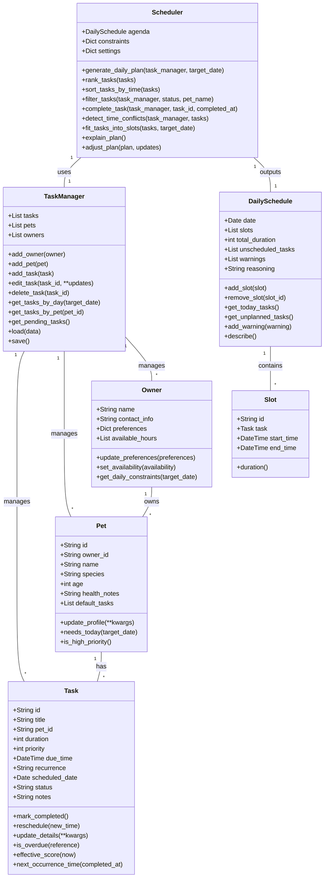

# PawPal+ Project Reflection

## 1. System Design

**Core Actions:**

- Enter owner + pet info
    - add owner name / preferences
    - add pet profile(s) (name, type, age, needs)
- Add task
    - create pet care tasks (walk, feeding, meds, grooming, enrichment, etc.)
    - include duration and priority (and optionally schedule constraints)
- Edit task
    - modify task details (duration, priority, type, pet association)
- Generate daily plan/schedule
    - run scheduler using constraints + priorities + available time
    - build list of today’s tasks in time order
- View today’s plan
    - display tasks for the day clearly
    - show schedule/time blocks
- Explain reasoning (optional but requested)
    - show why tasks were chosen/ordered (priority, constraints, time optimization)
- Testing/validate
    - automated checks for scheduling behavior (coverage for core logic)

**a. Initial design**

- Briefly describe your initial UML design.
- What classes did you include, and what responsibilities did you assign to each?

  - `Owner`
    - attributes: `name`, `contact_info`, `preferences`, `available_hours`
      - e.g., owner preferences for times and max daily task load
    - methods: `update_preferences()`, `set_availability()`, `get_daily_constraints()`
      - (adjust preference data, define when owner is available, return constraints for scheduling)

  - `Pet`
    - attributes: `name`, `species`, `age`, `health_notes`, `default_tasks`
      - (house pet profile and baseline care needs)
    - methods: `update_profile()`, `needs_today()`, `is_high_priority()`
      - (update details, determine today-specific task need, identify urgent care)

  - `Task`
    - attributes: `id`, `title`, `pet_id`, `duration`, `priority`, `due_time`, `recurrence`, `status`, `notes`
      - (defines each care item and metadata for schedule logic)
    - methods: `mark_completed()`, `reschedule(new_time)`, `update_details()`, `is_overdue()`, `effective_score()`
      - (task lifecycle and score used for ranking/constraint decisions)

  - `TaskManager`
    - attributes: `tasks`, `pets`, `owners`
      - (data store for all entities, could be in-memory or persisted)
    - methods: `add_task()`, `edit_task()`, `delete_task()`, `get_tasks_by_day(date)`, `get_tasks_by_pet(pet_id)`, `get_pending_tasks()`, `load/save()`
      - (CRUD plus helper query methods and persistence)

  - `Scheduler`
    - attributes: `agenda`, `constraints`, `settings`
      - (schedule candidate data plus constraint information and tuning rules)
    - methods: `generate_daily_plan(date)`, `rank_tasks()`, `fit_tasks_into_slots()`, `explain_plan()`, `adjust_plan()`
      - (core heuristics: build a plan, rank, pack into time slots, and explain or tweak results)

  - `DailySchedule`
    - attributes: `date`, `slots`, `total_duration`, `unscheduled_tasks`, `reasoning`
      - (concrete daily output plus any remaining tasks and scheduling narrative)
    - methods: `add_slot(task,start_time)`, `remove_slot(slot_id)`, `get_today_tasks()`, `get_unplanned_tasks()`, `describe()`
      - (manage produced schedule entries and derive display text)

**Mermaid class diagram**

**b. Design changes**

- Did your design change during implementation?
- If yes, describe at least one change and why you made it.

- Added owner_id to Pet
    - Reason: Enforces the Owner 1-* Pet relationship from the diagram; avoids orphan pets in logic and supports per-owner task filtering.
- Added scheduled_date to Task
    - Reason: TaskManager.get_tasks_by_day() now has a concrete way to filter tasks. Without this, “by-day” queries are ambiguous and would require separate “due_time” treatment.
- Added Slot dataclass and switched DailySchedule.slots to List[Slot]
    - Reason: Makes schedule slot structure explicit; improves type safety and aligns with the idea of timetable entries, rather than opaque dicts.
- Updated DailySchedule.add_slot() signature to take Slot
    - Reason: Avoids stale code path mismatch (task+start_time vs structured slot object), and future-proofs schedule manipulation.

---

## 2. Scheduling Logic and Tradeoffs

**a. Constraints and priorities**

- What constraints does your scheduler consider (for example: time, priority, preferences)?
- How did you decide which constraints mattered most?

**b. Tradeoffs**

- Describe one tradeoff your scheduler makes.
- Why is that tradeoff reasonable for this scenario?

Merge rank_tasks and sort_tasks_by_time into one ordering rule in pawpal_system.py:272

We currently have two separate sorting methods.
If the real scheduling behavior is “highest score first, earlier due time as tie-breaker,” then one sort is easier to reason about than two utilities.
Example rule:
sort by negative effective score
then by whether due_time is missing
then by due_time
That removes duplicated “how tasks are ordered” logic.

---

## 3. AI Collaboration

**a. How you used AI**

- How did you use AI tools during this project (for example: design brainstorming, debugging, refactoring)?
- What kinds of prompts or questions were most helpful?

**b. Judgment and verification**

- Describe one moment where you did not accept an AI suggestion as-is.
- How did you evaluate or verify what the AI suggested?

---

## 4. Testing and Verification

**a. What you tested**

- What behaviors did you test?
- Why were these tests important?

**b. Confidence**

- How confident are you that your scheduler works correctly?
- What edge cases would you test next if you had more time?

---

## 5. Reflection

**a. What went well**

- What part of this project are you most satisfied with?

**b. What you would improve**

- If you had another iteration, what would you improve or redesign?

**c. Key takeaway**

- What is one important thing you learned about designing systems or working with AI on this project?
